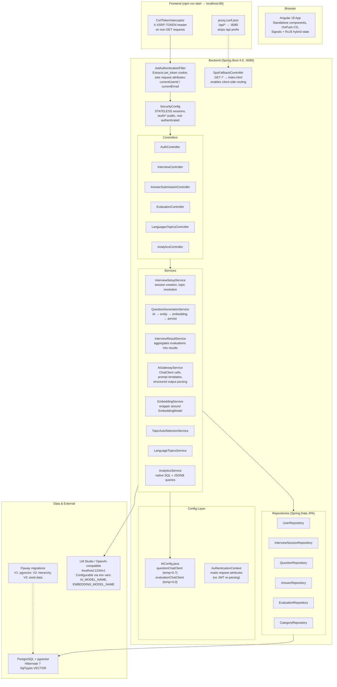
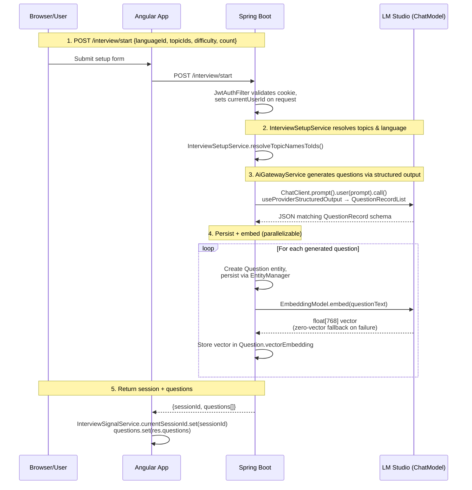

# AGENTS.md — Interview Prep Platform

## Stack
- **Frontend:** Angular 18 (standalone components, `loadComponent()` lazy loading, Material UI, OnPush CD)
- **Backend:** Spring Boot 4.0, Java 25, PostgreSQL + pgvector (Hibernate 7 `SqlTypes.VECTOR`), Flyway migrations, JWT cookie auth
- **AI:** Spring AI 2.0 (`spring-ai-bom 2.0.0`) with OpenAI-compatible endpoint (LM Studio at `localhost:1234`, configurable via env var)

## Layout
```
backend/src/main/java/com/interviewprep/
  analytics/          — AnalyticsController + AnalyticsService (native SQL, JSONB queries)
  auth/               — AuthController (register/login/logout/status)
  config/             — SecurityConfig, JwtAuthenticationFilter, AuthenticationContext, CorsConfig, CsrfCookieFilter, SpaFallbackController, AiConfig, ValidationExceptionHandler
  domain/             — JPA entities (User, InterviewSession, Question, Answer, Evaluation, Category), Repositories, DTO records/enums
  interview/          — Controllers + Services: session lifecycle, question generation, results, evaluation retry, language/topic lookup
  question/AiGatewayService.java   — Spring AI bridge: ChatClient calls, prompt templates, native structured output parsing
  embedding/EmbeddingService.java  — Wrapper around EmbeddingModel for vector embeddings
  service/            — TopicAutoSelectionService, LanguageTopicsService

frontend/src/app/
  analytics/          — AnalyticsPageComponent (ng2-charts + Material table)
  auth/               — LoginComponent, RegisterComponent
  components/         — NavbarComponent
  evaluation/         — ResultsPageComponent
  guards/             — AuthGuard (functional CanActivateFn), IdlePreloadingStrategy
  interview/          — SetupPage, InterviewPage, CodingQuestion, TheoryQuestion
  interceptors/       — CsrfTokenInterceptor (adds X-XSRF-TOKEN for non-GET)
  services/           — AuthService (signals + Observables hybrid), InterviewSignalService (WritableSignals + Maps), DropdownDataService (BehaviorSubject cache)
  shared/theme/       — ThemeService (signal-based, localStorage persistence + StorageEvent cross-tab sync)
```

## Architecture & Data Flow



### Request Flow: Start Interview (most complex flow)



### Auth Flow: JWT Cookie Lifecycle

```mermaid
sequenceDiagram
    participant Browser as Browser (HttpOnly cookie jar)
    participant BE as Spring Boot

    Note over Browser,BE: Register or Login
    Browser->>BE: POST /auth/register or /auth/login
    BE->>BE: BCrypt password hash + JwtService.generate(email, userId)
    BE-->>Browser: Set-Cookie: jwt_token=eyJ...<br/>HttpOnly; SameSite=Strict<br/>Expires=8h

    Note over Browser,BE: Every subsequent request
    loop Authenticated requests
        Browser->>BE: GET/POST /interview/* ... (cookie auto-sent)
        BE->>BE: JwtAuthFilter extracts token from cookie<br/>Jwts.parser().verifyWith(key).parseSignedClaims()<br/>sets currentUserId/currentEmail on request
        BE-->>Browser: Response
    end

    Note over Browser,BE: Logout
    Browser->>BE: POST /auth/logout
    BE-->>Browser: Set-Cookie: jwt_token=; Max-Age=0<br/>(clears the cookie)
```

## Commands

```bash
# Frontend dev server (dev:80 → backend:8080, /api/* prefix stripped by proxy)
cd frontend && npm run start

# Frontend build (outputs to dist/interview-prep-frontend/)
cd frontend && npm run build

# Lint — catches effect() placement violations + TS rules
cd frontend && npm run lint

# Backend compile only (skips frontend-maven-plugin)
cd backend && mvn compile -DskipTests

# Full build: installs Node 20.18, runs `npm install --legacy-peer-deps`, then ng build → static files into backend/src/main/resources/static/browser/
cd backend && mvn compile   # or mvn package for executable jar

# Backend tests (H2 in-memory DB)
cd backend && mvn test
```

## Critical rules

1. **`effect()` only in constructors or field initializers.** Inside `ngOnInit()`, methods, or event handlers throws NG0203. Enforced by custom ESLint rule `effect-placement/no-effect-outside-constructor`. Run `npm run lint` to verify.
2. **OnPush + async data requires signals or explicit `markForCheck()`.** Plain property assignments in subscribe callbacks don't trigger CD on OnPush components. Use signal `.set()` (see `AuthService`) or inject `ChangeDetectorRef` and call `cdr.markForCheck()`.
3. **Frontend build output path.** Angular outputs to `dist/interview-prep-frontend/browser/`. The Maven plugin copies it into `backend/src/main/resources/static/browser/`. Changing the Angular outputPath requires updating both the maven plugin config AND `SpaFallbackController`'s classpath resource path.
4. **Lombok annotation processing is configured in Maven** (`maven-compiler-plugin.annotationProcessorPaths`). IDE LSP errors showing undefined getters/setters on Lombok-annotated classes (e.g., `@Data` records) are false positives — `mvn compile` works fine.

## Auth flow
- JWT stored in HttpOnly cookie `jwt_token`, set by `AuthController` via `ResponseCookie.from()`.
- `JwtAuthenticationFilter` extracts token from cookies, validates with jjwt 0.12.x (`Jwts.parser().verifyWith(key).build().parseSignedClaims()`), sets request attributes `currentUserId`/`currentEmail`.
- `AuthenticationContext.getCurrentUserId()` reads request attributes (no re-parsing of JWT in service layer).
- CSRF disabled globally — safe because cookie is HttpOnly + SameSite=Strict. The `CsrfCookieFilter`/`CsrfTokenCookieGenerator` handle cross-origin XSRF-TOKEN flow for Angular's interceptor.
- `SecurityConfig`: `/auth/*` routes permitted; all others authenticated. Session policy: STATELESS.

## AI integration
- Two `ChatClient` beans in `AiConfig.java`: `questionChatClient` (temp=0.7, creative generation) and `evaluationChatClient` (temp=0.0 via separate bean config). Configured via `application.properties`.
- **Native structured output** (Spring AI 2.0): Java records (`QuestionRecord`, `EvaluationRecord`) define output schema. Call: `.entity(QuestionRecordList.class, spec -> spec.useProviderStructuredOutput().validateSchema())`. Wrapper record `QuestionRecordList` needed because OpenAI structured output requires a top-level JSON object, not array.
- Prompt templates use Java text blocks (`"""...""".formatted(...)`) with language-specific system prompts for coding evaluation.
- **Resilience:** zero-vector fallback on embedding failure; per-answer try/catch during `finish()` so one failed AI call doesn't abort the session; `/evaluation/retry/{answerId}` endpoint to recover FAILED evaluations.

## Database
- PostgreSQL + pgvector extension (V1 migration). Vector column: `@JdbcTypeCode(SqlTypes.VECTOR)` on `Question.vectorEmbedding` with minimal `AttributeConverter<double[], double[]>`.
- Flyway migrations at `backend/src/main/resources/db/migration/` (V1: pgvector, V2: category hierarchy, V3: seed data). `ddl-auto=update` is on but Flyway manages schema.
- Env vars: `DB_HOST`, `DB_PORT`, `DB_NAME`, `DB_USERNAME`, `DB_PASSWORD` with defaults in `application.properties`. AI model name via `AI_MODEL_NAME` / `EMBEDDING_MODEL_NAME`.

## State management patterns
- **Auth state:** signals + sessionStorage dual-source. `AuthService.setAuthState()` calls `.set()` on signals alongside `sessionStorage.setItem()`. Navbar reads signals directly in template — Angular tracks signal reads for OnPush CD.
- **Interview session:** `InterviewSignalService` owns `currentSessionId`, questions, evaluations as WritableSignals; uses plain JS Maps for answers/coding submissions (no reference change needed when entries mutate individually).
- **Theme state:** internal `_mode` signal exposed as readonly `mode$`; effect in constructor toggles `<body>` CSS class on change.

## Common pitfalls
- Don't poll sessionStorage from route handlers to update OnPush views — use signals.
- Frontend dev server proxies `/api/*` → `localhost:8080` with path rewrite stripping `/api` prefix (see `proxy.conf.json`). Controllers receive requests at their mapped paths without `/api`.
- Analytics queries use native SQL with JSONB operations — won't work on other databases.
- Session cleanup via `SessionTimeoutCleanupTask` (@Scheduled every 5 min). Abandoned sessions older than `interview.session.timeout-hours` (default 2h) are purged automatically.
